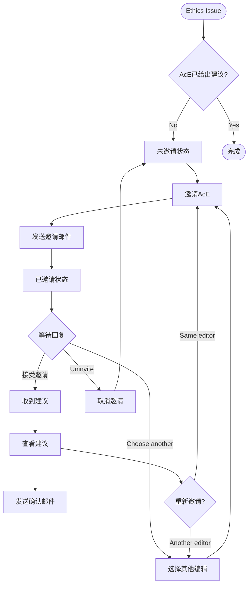

```mermaid
flowchart TD
    Start([Ethics Issue]) --> CheckAcE{AcE已给出建议?}

    CheckAcE -->|No| State1[未邀请状态]
    State1 --> InviteAcE[邀请AcE]
    InviteAcE --> SendEmail[发送邀请邮件]
    SendEmail --> State2[已邀请状态]

    State2 --> WaitResponse{等待回复}
    WaitResponse -->|接受邀请| State3[收到建议]
    WaitResponse -->|Uninvite| CancelInvite[取消邀请]
    WaitResponse -->|Choose another| ChooseEditor[选择其他编辑]

    CancelInvite --> State1
    ChooseEditor --> InviteAcE

    State3 --> ViewComment[查看建议]
    ViewComment --> SendAck[发送确认邮件]
    ViewComment --> ReInvite{重新邀请?}
    ReInvite -->|Same editor| InviteAcE
    ReInvite -->|Another editor| ChooseEditor

    CheckAcE -->|Yes| Done([完成])
```
